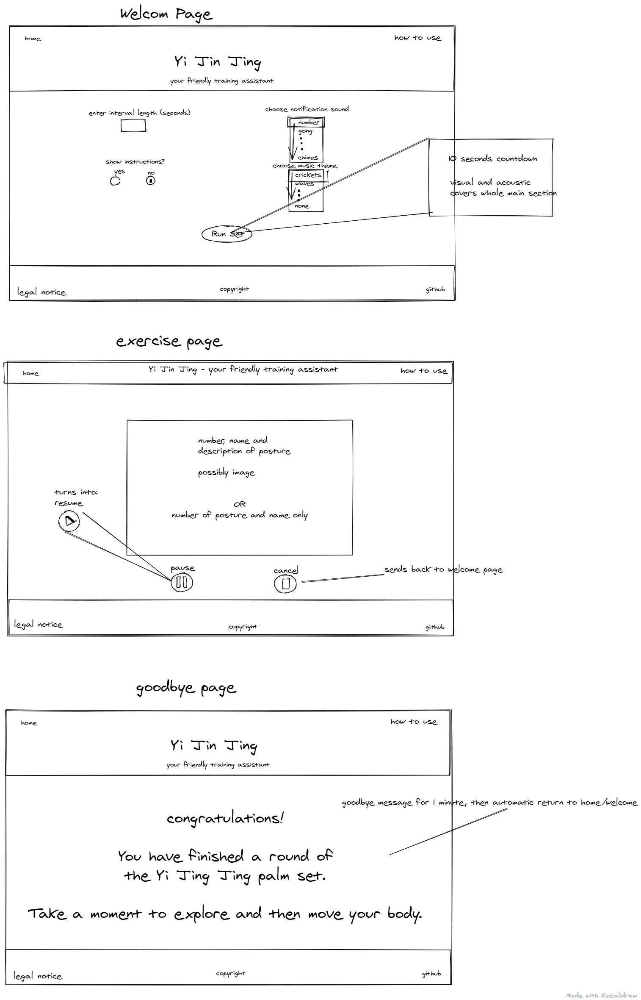

# Yi Jin Jing training assistant

## this is a work in progress:

a simple app to support you with going through the 12 postures of the Yi Jin Jing palm set.

### Core functionality:

The screen changes color 12 times with a starting sound for each change and stays at the same color for a previously given interval.

### Planned features:

-   enter different interval lengths throug user interface
-   option to select different sounds for section start
-   option to select different background sounds/music
-   display number of active section on screen
-   display short description of posture for each section on screen
-   option to hide description
-   30 seconds preparation time with countdown after pressing start before actual sequence begins
-   info and general instruction page
-   option to pause and resume
-   goodbye/cooldown page after end of set before returning to welcome page

### Wireframe:

### Sound effects are taken from ZapSplat

This project was bootstrapped with [Create React App](https://github.com/facebook/create-react-app).
